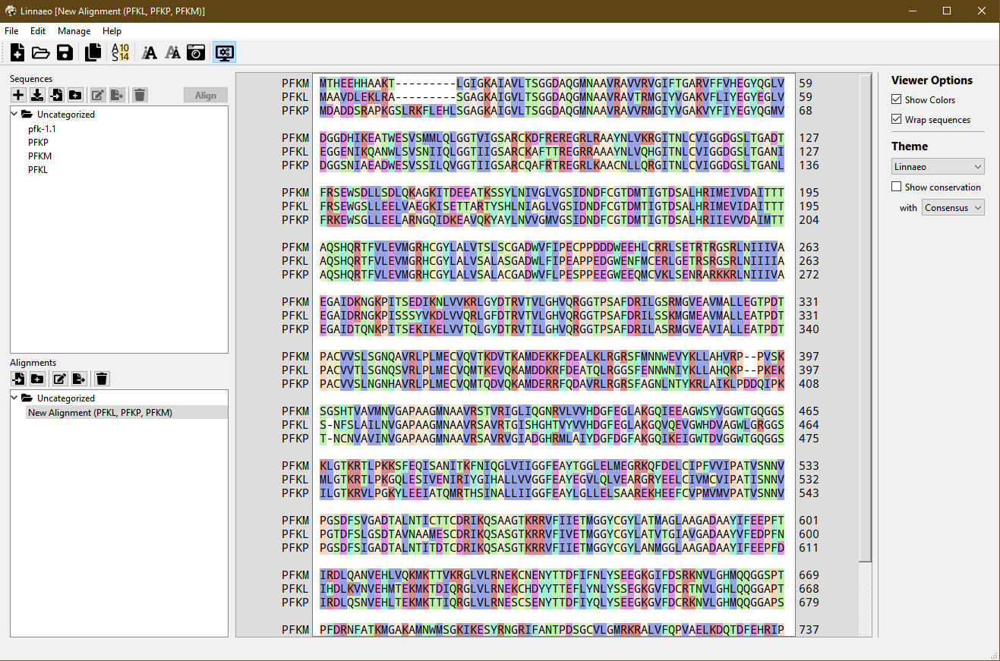

# Linnaeo: a protein sequence comparison tool

Linnaeo is a program designed to help draw conclusions about the structure-function relationship of proteins by providing an easy way to compare protein sequences. Often a protein that is well-studied in one organism (maybe the structure is known, or it has been studied enzymatically quite a bit) is not well understood in your species of interest. Making alignments can help you find equivalent residues to those that are characterized in these alternative protein sequences, as well as suggest other residues that are important based on how highly they are conserved. Linnaeo is therefore designed to allow you to:
 * Store and organize protein sequences you want to keep track of in folders
 * Generate (and organize) alignments dynamically from different combinations of those sequences using the MUSCLE algorithm
 * Color by residue type, conservation, or identity to a reference sequence
 * Export these alignments for use in other favorite alignment viewers
 
 Some of the features currently available:
  * Import sequences or alignments as FASTA files
  * Search and download sequences directly from UNIPROT into your workspace. 
  * Switch between horizontally-scrolled sequence view or dynamically-resized wrapped view.
  * A toggleable ruler mode to see a single column's residue IDs for all sequences at once
  * A few different themes to choose from, including color by residue category or hydrophobicity
  * Differential highlighting by sequence conservation or identity with a reference sequence
  * Cross-platform (compiles on all, but only Windows binaries at the moment -- more to come)!

#### Requirements to compile yourself

Qt 6.0
